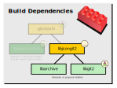

## Building libjsongit2

### Dependency packages



 - libgit2
 - libarchive (optional, for snapshot)

Distro|Dependency Package name
---|---
Fedora | libgit2, libgit2-devel, libarchive, libarchive-devel
Ububtu 14.04 | libgit2-0, libgit2-dev, libarchive13, libarchive-dev
Ubuntu 16.04 | libgit2-24, libgit2-dev, libarchive13, libarchive-dev

#### Note on libgit2 versions

libjsongit2 support libgit2 going back to v0.19 found in Ubuntu 14.04 and up
to current master.

Blame support requires libgit2 version >=0.21, but libjsongit2 adapts to
versions older than that by gracefully disabling blame.

0.28+ (and master libgit2) support `.mailmap` integration with blame, again if
it's not available libjsongit2 blame still works without it.

If you want to build a later, local libgit2 to get these features, it is also a
cmake project that's easy to build the same way as libjsongit2 itself.

You can direct libjsongit2 to build using your local libgit2 instead of the
packaged version like this:

```
$ cmake .. -DJG2_GIT2_INC_PATH=/usr/local/include \
           -DJG2_GIT2_LIB_PATH=/usr/local/lib/libgit2.so
```

### Build

```
 $ mkdir build
 $ cd build
 $ cmake ..
 $ make && sudo make install
```

Installs to /usr/local by default; the examples are in /usr/local/bin.

Run ldconfig after first build so the library is recognized.

Use the api in `/usr/local/include/libjsongit2.h` and link against
`/usr/local/lib/libjsongit2.so`.

You can configure the library to be built with symbols using
```
 $ cmake .. -DCMAKE_BUILD_TYPE=DEBUG
```

